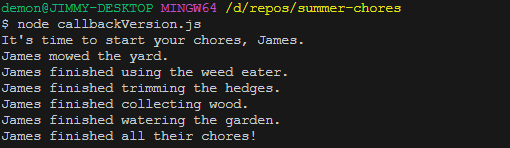
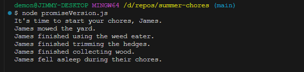

# 🔭 Assignment: Summer Chores

This assignment has 3 versions: `callbackVersion.js`, `promiseVersion.js`, and `asyncAwaitVersion`.

This is a series of exercises based on the "Bro Code" videos. By the end of this series of exercises, you should have three separate JavaScript files in the project. We will also be using Node for this project. If you have been watching the FreeCodeCamp JavaScript video snippets, you should have seen countless times how to run a JavaScript file with Node. If you need a refresher on the process, start the video from the beginning.  

# Callback Version Instructions

- Navigate to the folder where all your projects are stored and create a new project named summer-chores
- cd into the project and create a JavaScript file named callbackVersion.js
- Inside the file, complete the exercise according to the description section
- Create a GitHub repository with the name summer-chores
- Update your README so that it aligns with what you've learned about writing README files.
- When finished, push your changes to your repository and submit the link to your GitHub repository.  

# Promise Version Instructions

- Navigate to the your summer-chores project.
- Inside the project, create a JavaScript file named promiseVersion.js
- Inside the file, write the same program as before, but using promises instead of callback functions.
- Update your doSummerChores function to chain your promises
- Update your README so that it aligns with what you've updated during this assignment.
- When finished, push your changes to your repository and submit the link to your GitHub repository.  

# Async/Await Version Instructions

- Navigate to the your summer-chores project.
- Inside the project, create a JavaScript file named asyncAwaitVersion.js
- Inside the file, write the same program as before, but update the doSummerChores function to use async and await instead of chaining your promises.
- Update your README so that it aligns with what you've updated during this assignment.
- When finished, push your changes to your repository and submit the link to your GitHub repository.  

# Clone and Run

There is nothing to install. Create a clone/fork of this repo and use node to execute the code.

# Output

