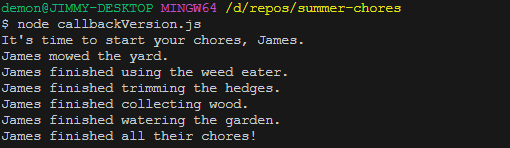

# 🔭 Callback Assignment: Summer Chores

# Overview
This is part one of a series of exercises based on the "Bro Code" videos. By the end of this series of exercises, you should have three separate JavaScript files in the project. We will also be using Node for this project. If you have been watching the FreeCodeCamp JavaScript video snippets, you should have seen countless times how to run a JavaScript file with Node. If you need a refresher on the process, start the video from the beginning.

# Clone and Run
There is nothing to install. Create a clone/fork of this repo and use node to execute the code.

# Output
